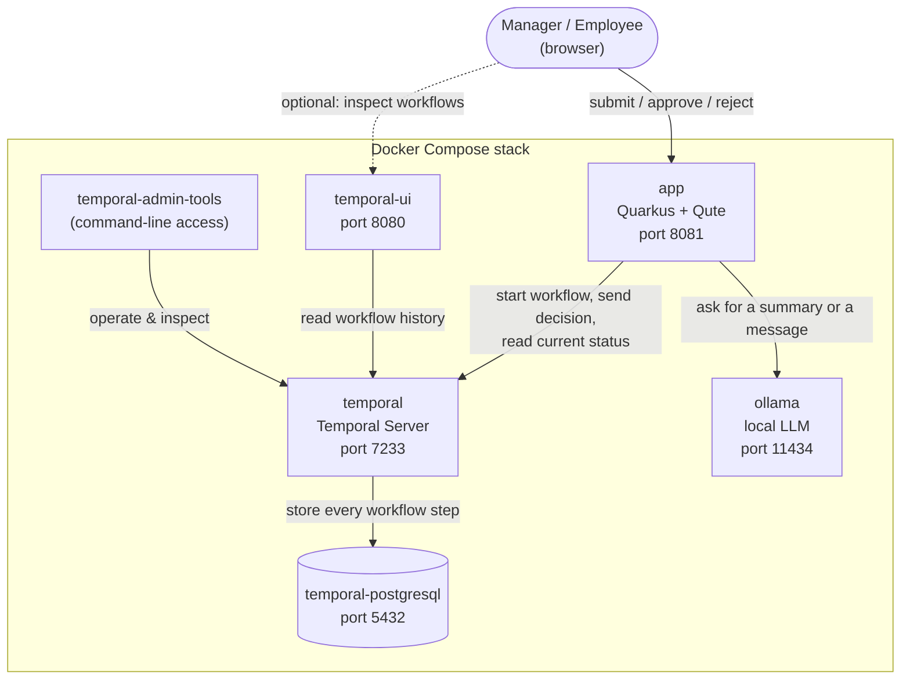
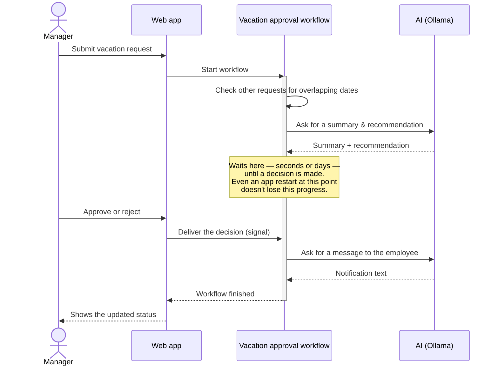

# LangChain4j Meets Temporal — Vacation Approval Demo

Reference implementation for a live-coding session building a vacation approval system with
[LangChain4j](https://docs.langchain4j.dev/), [Temporal](https://temporal.io/), and
[Quarkus](https://quarkus.io/) + [Qute](https://quarkus.io/guides/qute).

[](https://youtube.com/live/saM_XnON5cA)

Docker Compose brings up a Temporal server, its Postgres persistence store, the Temporal Web
UI, and a GPU-accelerated Ollama instance for LangChain4j. The Quarkus app connects to all of
it and runs a full vacation-approval workflow:

- A deterministic **conflict check** scans other pending/approved requests for overlapping
  dates before anything else runs, so the AI step reasons about real data instead of guessing.
- An **AI recommendation** step summarizes the request and recommends approve/deny, grounded
  in those conflicts.
- The workflow then waits for a manager's decision via a Temporal **Signal**.
- Once decided, an **AI notification** step drafts a short message to the employee explaining
  the outcome.
- Restarting the app mid-workflow (`docker compose restart app`) demonstrates that Temporal
  resumes exactly where it left off, with no state lost.

## Architecture

Everything below runs as separate containers on one Docker network. The app is the only piece
that talks to both Temporal (to run the workflow) and Ollama (to get AI text) — nothing else
needs to know they exist.



A few things worth noting:

- The **app never stores any vacation data itself** — every request, decision, and AI reply
  lives inside Temporal's own state (backed by Postgres). If the app container disappears and
  comes back, nothing is lost; see the note about crash recovery below.
- **Ollama and Temporal don't know about each other.** Only the app talks to both, so it's the
  one place that connects "an AI reply" to "a step in a workflow".
- `temporal-ui` and `temporal-admin-tools` are purely observability/debugging aids — you could
  delete both and the app would work exactly the same.

## How the vacation approval workflow works

A "workflow" here just means: a series of steps that Temporal remembers the progress of, even
across restarts. Submitting a request kicks one off, and it doesn't finish until a manager has
made a decision — which might be seconds or days later.



The middle "waits here" step is the whole point of using Temporal: an ordinary web request
can't just sit open for days waiting for someone to click a button, but a Temporal workflow
can — because its progress is durably recorded on the server, not held in the app's memory.
That's also why `docker compose restart app` mid-demo is safe: the app comes back, reconnects,
and every workflow that was waiting simply keeps waiting, exactly where it left off.

## Prerequisites

- Docker + Docker Compose
- An NVIDIA GPU with the [NVIDIA Container Toolkit](https://docs.nvidia.com/datacenter/cloud-native/container-toolkit/latest/install-guide.html)
  installed (for GPU-accelerated Ollama). Without a GPU, remove the `deploy.resources.reservations.devices`
  block from the `ollama` service in `docker-compose.yml` to fall back to CPU inference.
- JDK 21 and Maven — only needed if you want to run the app on the host via `quarkus:dev`;
  the wrapper (`./mvnw`) handles the Maven version, and the containerized build stage
  brings its own JDK.

## Running everything in Docker

```bash
docker compose up -d --build
```

This builds the Quarkus app image (compiling it from source inside the build stage — no
local Maven run required) and starts the full stack: Temporal, Postgres, Temporal UI,
Ollama, and the app itself.

One-time step after the first `up`: pull the model Ollama will serve (~2GB download —
do this **before** going live, not on stream):

```bash
docker exec ollama ollama pull llama3.2:3b
```

`llama3.2:3b` was picked over the larger `llama3.1` (8B) specifically because it fits
entirely in a modest GPU's VRAM — an 8B model that only partially offloads to the GPU spills
the rest onto the CPU/RAM and can make the whole machine feel sluggish while it's warming up
or answering. If you have a beefier GPU, a larger model works too; just update
`quarkus.langchain4j.ollama.chat-model.model-name` in `application.properties` to match.

URLs:

- App: <http://localhost:8081>
- Temporal Web UI: <http://localhost:8080>
- Ollama API: <http://localhost:11434>

To demonstrate workflow recovery, restart just the app container and watch Temporal resume
whichever workflows were mid-flight:

```bash
docker compose restart app
```

## Running the app on the host (live-coding inner loop)

For hot reload while writing code, run only the infrastructure in Docker and the app on
the host:

```bash
docker compose up -d postgresql temporal temporal-admin-tools temporal-ui ollama
./mvnw quarkus:dev
```

The app listens on <http://localhost:8081> either way; the Dev UI is at
<http://localhost:8081/q/dev/>.

## Using OpenAI instead of Ollama

The baseline uses local, GPU-accelerated Ollama so the demo needs no API key and incurs no
per-token cost while streaming. To use OpenAI instead, swap the
`io.quarkiverse.langchain4j:quarkus-langchain4j-ollama` dependency in `pom.xml` for
`io.quarkiverse.langchain4j:quarkus-langchain4j-openai`, and set
`quarkus.langchain4j.openai.api-key` (e.g. via the `OPENAI_API_KEY` env var) instead of the
`quarkus.langchain4j.ollama.*` properties.

## Project layout

- `workflow/` — `VacationApprovalWorkflow`: conflict check → AI summary → wait for signal →
  AI notification
- `activity/` — `VacationConflictActivity` (deterministic), `VacationAiActivity` and
  `VacationNotificationActivity` (LangChain4j-backed)
- `ai/` — the two LangChain4j AI services: `VacationAdvisor` (manager-facing recommendation)
  and `VacationNotifier` (employee-facing message)
- `web/` — REST resources and Qute-rendered pages, including the auto-refreshing pending/decided lists
