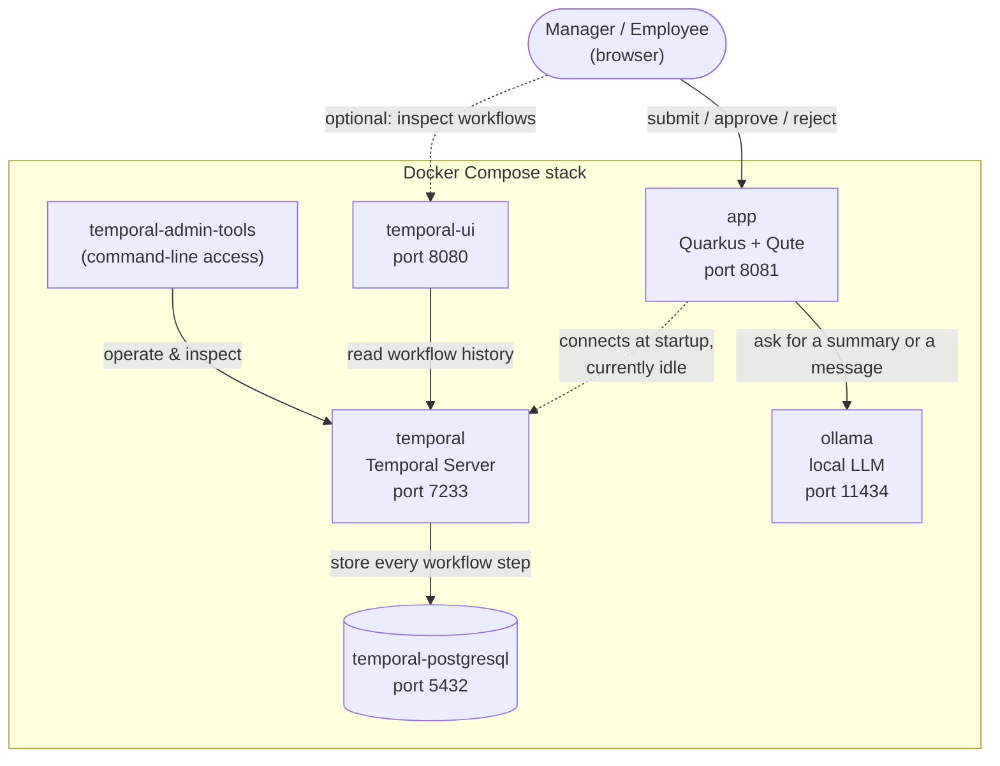
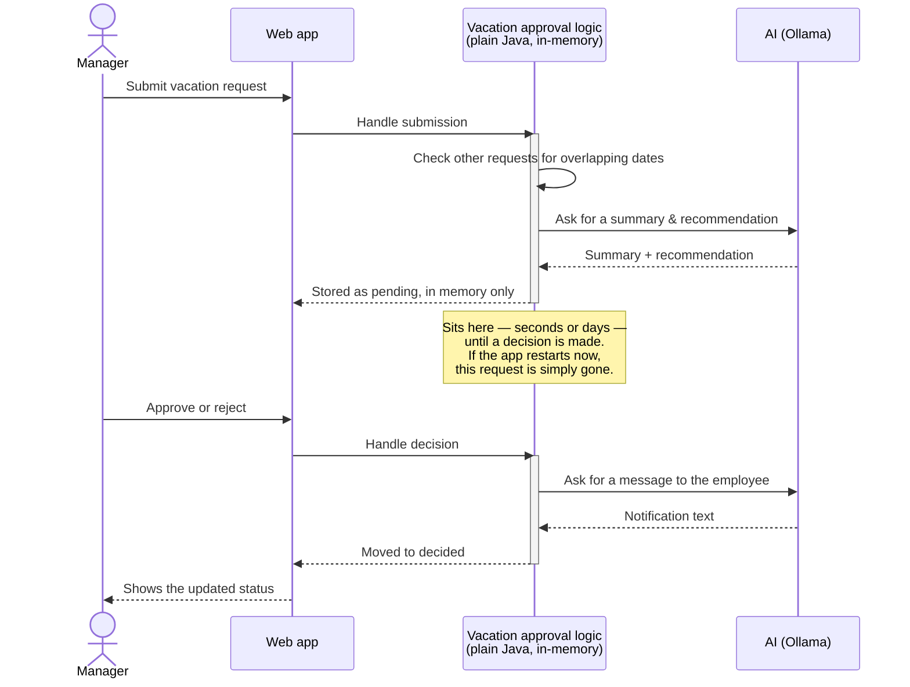

# LangChain4j Meets Temporal — Vacation Approval Demo

Starting point for a live-coding session building a vacation approval system with
[LangChain4j](https://docs.langchain4j.dev/), [Temporal](https://temporal.io/), and
[Quarkus](https://quarkus.io/) + [Qute](https://quarkus.io/guides/qute).

[](https://youtube.com/live/saM_XnON5cA)

Docker Compose brings up a Temporal server, its Postgres persistence store, the Temporal Web
UI, and a GPU-accelerated Ollama instance for LangChain4j — all ready to go. The Quarkus app
itself, though, doesn't use Temporal yet. It already runs a full vacation-approval process,
just as plain, in-memory Java:

- A **conflict check** scans other pending/approved requests for overlapping dates before
  anything else runs, so the AI step reasons about real data instead of guessing.
- An **AI recommendation** step summarizes the request and recommends approve/deny, grounded
  in those conflicts.
- The request then sits in memory waiting for a manager's decision.
- Once decided, an **AI notification** step drafts a short message to the employee explaining
  the outcome.

That "sits in memory" part is the catch: restart the app while a request is pending, and it's
gone — no retry, no recovery, nothing left to show the manager. **That's the live session**:
turning this into a durable Temporal workflow, so the exact same steps survive a crash, wait
for a signal instead of blocking in memory, and retry the AI calls on failure.

## Architecture

Everything below runs as separate containers on one Docker network. The app is the only piece
that talks to both Temporal and Ollama (to get AI text) — nothing else needs to know they
exist.



A few things worth noting:

- **Temporal is running but not doing anything yet.** The app connects to it at startup (the
  `quarkus-temporal` extension does this even with zero workflows registered), but nothing is
  wired up to actually use it — that connection is what the live session builds on.
- The **app keeps all vacation data in its own memory**, not in Temporal or Postgres. Restart
  the app container and every pending request disappears — see the next section.
- **Ollama and Temporal don't know about each other.** Only the app talks to both, so it's the
  one place that connects "an AI reply" to a step in the process.
- `temporal-ui` and `temporal-admin-tools` are purely observability/debugging aids for once
  Temporal is wired in — you could delete both today and nothing would change.

## How the vacation approval process works today

Submitting a request kicks off a few steps, and the interesting one is in the middle: the
request just sits there, in memory, until a manager makes a decision — which might be seconds
or days later.



That middle note is the whole reason this session exists. An ordinary web request can't stay
open for days waiting for a click, so today's version stores the pending request in a plain
Java map instead — which works fine right up until the process restarts, redeploys, or
crashes, at which point that map (and every request in it) is gone. Try it yourself: submit a
request, leave it pending, then restart the app and reload the page.

Temporal exists to fix exactly this: it durably records a workflow's progress on the server, so
a step like "wait for a manager's decision" can safely take days and survive restarts, retries,
and deploys without an in-memory map anywhere. Converting the vacation approval logic into a
Temporal workflow — with the AI and conflict-check steps as activities, and the decision
delivered as a signal instead of a direct method call — is what we build live.

## Prerequisites

- Docker + Docker Compose
- An NVIDIA GPU with the [NVIDIA Container Toolkit](https://docs.nvidia.com/datacenter/cloud-native/container-toolkit/latest/install-guide.html)
  installed (for GPU-accelerated Ollama). Without a GPU, remove the `deploy.resources.reservations.devices`
  block from the `ollama` service in `docker-compose.yml` to fall back to CPU inference.
- JDK 21 and Maven — only needed if you want to run the app on the host via `quarkus:dev`;
  the wrapper (`./mvnw`) handles the Maven version, and the containerized build stage
  brings its own JDK.

## Running everything in Docker

```bash
docker compose up -d --build
```

This builds the Quarkus app image (compiling it from source inside the build stage — no
local Maven run required) and starts the full stack: Temporal, Postgres, Temporal UI,
Ollama, and the app itself.

One-time step after the first `up`: pull the model Ollama will serve (~2GB download —
do this **before** going live, not on stream):

```bash
docker exec ollama ollama pull llama3.2:3b
```

`llama3.2:3b` was picked over the larger `llama3.1` (8B) specifically because it fits
entirely in a modest GPU's VRAM — an 8B model that only partially offloads to the GPU spills
the rest onto the CPU/RAM and can make the whole machine feel sluggish while it's warming up
or answering. If you have a beefier GPU, a larger model works too; just update
`quarkus.langchain4j.ollama.chat-model.model-name` in `application.properties` to match.

URLs:

- App: <http://localhost:8081>
- Temporal Web UI: <http://localhost:8080>
- Ollama API: <http://localhost:11434>

To see today's fragility for yourself: submit a request, leave it pending, then restart just
the app container and reload the page — the request is gone.

```bash
docker compose restart app
```

## Running the app on the host (live-coding inner loop)

For hot reload while writing code, run only the infrastructure in Docker and the app on
the host:

```bash
docker compose up -d postgresql temporal temporal-admin-tools temporal-ui ollama
./mvnw quarkus:dev
```

The app listens on <http://localhost:8081> either way; the Dev UI is at
<http://localhost:8081/q/dev/>.

## Using OpenAI instead of Ollama

The baseline uses local, GPU-accelerated Ollama so the demo needs no API key and incurs no
per-token cost while streaming. To use OpenAI instead, swap the
`io.quarkiverse.langchain4j:quarkus-langchain4j-ollama` dependency in `pom.xml` for
`io.quarkiverse.langchain4j:quarkus-langchain4j-openai`, and set
`quarkus.langchain4j.openai.api-key` (e.g. via the `OPENAI_API_KEY` env var) instead of the
`quarkus.langchain4j.ollama.*` properties.

## Project layout

- `workflow/` — the vacation approval process: plain domain records plus `VacationService`,
  today's in-memory (not yet Temporal) orchestrator
- `ai/` — the two LangChain4j AI services: `VacationAdvisor` (manager-facing recommendation)
  and `VacationNotifier` (employee-facing message)
- `web/` — REST resources and Qute-rendered pages, including the auto-refreshing pending/decided lists
