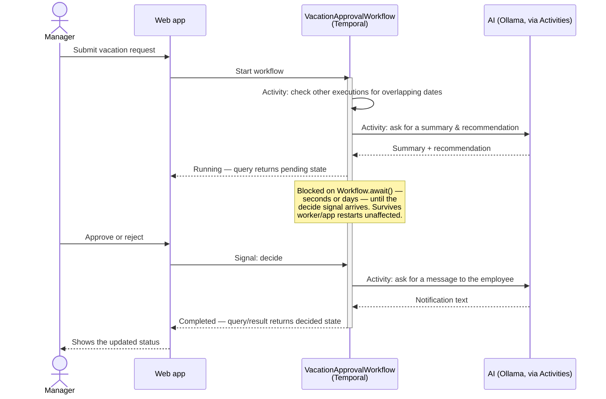

# LangChain4j Meets Temporal — Vacation Approval Demo

Starting point for a live-coding session building a vacation approval system with
[LangChain4j](https://docs.langchain4j.dev/), [Temporal](https://temporal.io/), and
[Quarkus](https://quarkus.io/) + [Qute](https://quarkus.io/guides/qute).

[](https://youtube.com/live/saM_XnON5cA)

Docker Compose brings up a Temporal server, its Postgres persistence store, the Temporal Web
UI, and a GPU-accelerated Ollama instance for LangChain4j — all ready to go. The vacation
approval process now runs as a durable `VacationApprovalWorkflow`:

- A **conflict check** activity looks at other running/decided workflow executions (via the
  Temporal Visibility API) for overlapping dates before anything else runs, so the AI step
  reasons about real data instead of guessing.
- An **AI recommendation** activity summarizes the request and recommends approve/deny,
  grounded in those conflicts. Both AI activities retry automatically on failure.
- The workflow then blocks on `Workflow.await(...)`, waiting for a `decide` **signal** from a
  manager — this can safely take seconds or days, since Temporal durably records the wait.
- Once decided, an **AI notification** activity drafts a short message to the employee
  explaining the outcome, and the workflow completes.

Because the pending state now lives in Temporal's own event history instead of a plain Java
map, restarting the app (or the worker) while a request is pending no longer loses it: the
workflow simply resumes waiting for its signal.

## Architecture

Everything below runs as separate containers on one Docker network. The app is the only piece
that talks to both Temporal and Ollama (to get AI text) — nothing else needs to know they
exist.


A few things worth noting:

- **Temporal now drives the whole approval process.** The app starts a
  `VacationApprovalWorkflow` execution per request, signals it with the manager's decision, and
  queries running/completed executions to render the pending/decided lists — no more in-memory
  maps.
- **Every pending request lives in Temporal/Postgres, not the app's own memory.** Restart the
  app container and pending requests are unaffected — see the next section.
- **Ollama and Temporal don't know about each other.** Only the app talks to both: the AI calls
  run as Activities dispatched by the workflow, and only the app process actually calls Ollama.
- `temporal-ui` and `temporal-admin-tools` are purely observability/debugging aids — open
  <http://localhost:8080> to watch a `VacationApprovalWorkflow` execution progress step by step.

## How the vacation approval process works now

Submitting a request starts a workflow execution, and the interesting part is in the middle:
the workflow blocks on a signal until a manager makes a decision — which might be seconds or
days later — without holding a web request open or keeping anything in the app's own memory.



That "blocked on `Workflow.await()`" note is the whole point: an ordinary web request can't
stay open for days waiting for a click, and a plain in-memory map disappears the moment the
process restarts, redeploys, or crashes. A Temporal workflow instead durably records its
progress in the server's event history, so "wait for a manager's decision" can safely take days
and survive restarts, retries, and deploys without an in-memory map anywhere. Try it yourself:
submit a request, leave it pending, then restart the app and reload the page — it's still
there.

The conflict-check and both AI calls run as Activities (`VacationActivities`), each retried
automatically by Temporal on failure; the decision is delivered as a `@SignalMethod` instead of
a direct method call.

## Prerequisites

- Docker + Docker Compose
- An NVIDIA GPU with the [NVIDIA Container Toolkit](https://docs.nvidia.com/datacenter/cloud-native/container-toolkit/latest/install-guide.html)
  installed (for GPU-accelerated Ollama). Without a GPU, remove the `deploy.resources.reservations.devices`
  block from the `ollama` service in `docker-compose.yml` to fall back to CPU inference.
- JDK 21 and Maven — only needed if you want to run the app on the host via `quarkus:dev`;
  the wrapper (`./mvnw`) handles the Maven version, and the containerized build stage
  brings its own JDK.

## Running everything in Docker

```bash
docker compose up -d --build
```

This builds the Quarkus app image (compiling it from source inside the build stage — no
local Maven run required) and starts the full stack: Temporal, Postgres, Temporal UI,
Ollama, and the app itself.

One-time step after the first `up`: pull the model Ollama will serve (~2GB download —
do this **before** going live, not on stream):

```bash
docker exec ollama ollama pull llama3.2:3b
```

`llama3.2:3b` was picked over the larger `llama3.1` (8B) specifically because it fits
entirely in a modest GPU's VRAM — an 8B model that only partially offloads to the GPU spills
the rest onto the CPU/RAM and can make the whole machine feel sluggish while it's warming up
or answering. If you have a beefier GPU, a larger model works too; just update
`quarkus.langchain4j.ollama.chat-model.model-name` in `application.properties` to match.

URLs:

- App: <http://localhost:8081>
- Temporal Web UI: <http://localhost:8080>
- Ollama API: <http://localhost:11434>

To see the durability for yourself: submit a request, leave it pending, then restart just the
app container and reload the page — the request is still there, still pending.

```bash
docker compose restart app
```

## Running the app on the host (live-coding inner loop)

For hot reload while writing code, run only the infrastructure in Docker and the app on
the host:

```bash
docker compose up -d postgresql temporal temporal-admin-tools temporal-ui ollama
./mvnw quarkus:dev
```

The app listens on <http://localhost:8081> either way; the Dev UI is at
<http://localhost:8081/q/dev/>.

## Using OpenAI instead of Ollama

The baseline uses local, GPU-accelerated Ollama so the demo needs no API key and incurs no
per-token cost while streaming. To use OpenAI instead, swap the
`io.quarkiverse.langchain4j:quarkus-langchain4j-ollama` dependency in `pom.xml` for
`io.quarkiverse.langchain4j:quarkus-langchain4j-openai`, and set
`quarkus.langchain4j.openai.api-key` (e.g. via the `OPENAI_API_KEY` env var) instead of the
`quarkus.langchain4j.ollama.*` properties.

## Project layout

- `workflow/` — the vacation approval process: domain records, the `VacationApprovalWorkflow`
  (interface + implementation), the `VacationActivities` wrapping conflict-check/AI calls, and
  `VacationService`, the thin `WorkflowClient`-based orchestrator the web layer talks to
- `ai/` — the two LangChain4j AI services: `VacationAdvisor` (manager-facing recommendation)
  and `VacationNotifier` (employee-facing message)
- `web/` — REST resources and Qute-rendered pages, including the auto-refreshing pending/decided lists
